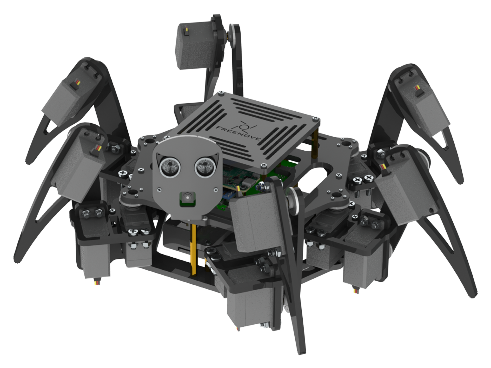

## Proyecto Hexápodo con Comunicación Distribuida

Este proyecto implementa un sistema de control distribuido para un robot hexápodo, basado en el repositorio de Freenove para el **Freenove Big Hexapod Robot Kit for Raspberry Pi**. Utiliza **sockets UDP** para la comunicación entre un hexápodo físico y una simulación en Unity.

### **1. Movimientos del Hexápodo**
El archivo `movimientos.py` define la clase `bailes`, que permite controlar los movimientos básicos del hexápodo, incluyendo:
- Avanzar
- Retroceder
- Movimiento lateral izquierdo y derecho
- Ajuste de altura

El módulo incluye métodos específicos para la ejecución de cada tipo de movimiento, utilizando un controlador de hardware para el hexápodo.

### **2. Pruebas de Movimientos**
El archivo `test_movimientos.py` permite probar los movimientos del hexápodo de forma manual mediante comandos de teclado. 

Este script:
- Presenta un menú interactivo al usuario.
- Permite ejecutar movimientos con comandos simples como `W`, `A`, `S`, `D`.
- Facilita la depuración y prueba sin necesidad de conectar Unity.

### **3. Comunicación Distribuida con Unity**
Se implementa un servidor UDP en `udp_server_4.py` que:
- Recibe comandos desde Unity.
- Ejecuta los movimientos correspondientes en el hexápodo.
- Envía datos de posición y orientación del robot al simulador en Unity.

Este servidor actúa como intermediario entre la simulación y el robot físico, permitiendo un control en tiempo real.

### **4. Objetivos del Proyecto**
- Integrar un robot físico con una simulación en Unity mediante sistemas distribuidos.
- Implementar coordinación multi-robot con algoritmos de seguimiento y comunicación en tiempo real.
- Explorar la combinación de hardware y simulación para robótica autónoma.

### **5. Créditos y Base del Proyecto**
Este trabajo toma como base el repositorio de Freenove para el **Freenove Big Hexapod Robot Kit for Raspberry Pi**, adaptándolo para implementar un sistema de comunicación distribuido y simulación en Unity.
## Freenove Big Hexapod Robot Kit for Raspberry Pi

> A Hexapod Robot Kit for Raspberry Pi.

### Download

* **Use command in console**

	Run following command to download all the files in this repository.

	`git clone https://github.com/Freenove/Freenove_Big_Hexapod_Robot_Kit_for_Raspberry_Pi.git`

* **Manually download in browser**

	Click the green "Clone or download" button, then click "Download ZIP" button in the pop-up window.
	Do NOT click the "Open in Desktop" button, it will lead you to install Github software.

> If you meet any difficulties, please contact our support team for help.

### Support

Freenove provides free and quick customer support. Including but not limited to:

* Quality problems of products
* Using Problems of products
* Questions of learning and creation
* Opinions and suggestions
* Ideas and thoughts

Please send an email to:

[support@freenove.com](mailto:support@freenove.com)

We will reply to you within one working day.

### Purchase

Please visit the following page to purchase our products:

http://store.freenove.com

Business customers please contact us through the following email address:

[sale@freenove.com](mailto:sale@freenove.com)

### Copyright

All the files in this repository are released under [Creative Commons Attribution-NonCommercial-ShareAlike 3.0 Unported License](http://creativecommons.org/licenses/by-nc-sa/3.0/).

This means you can use them on your own derived works, in part or completely. But NOT for the purpose of commercial use.
You can find a copy of the license in this repository.

Freenove brand and logo are copyright of Freenove Creative Technology Co., Ltd. Can't be used without formal permission.

### About

Freenove is an open-source electronics platform.

Freenove is committed to helping customer quickly realize the creative idea and product prototypes, making it easy to get started for enthusiasts of programing and electronics and launching innovative open source products.

Our services include:

* Robot kits
* Learning kits for Arduino, Raspberry Pi and micro:bit
* Electronic components and modules, tools
* Product customization service

Our code and circuit are open source. You can obtain the details and the latest information through visiting the following web site:

http://www.freenove.com
